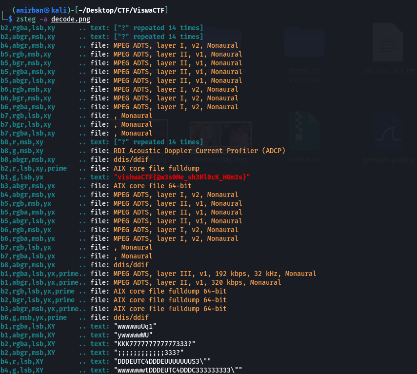

# Solution

After trying all possible steganography tricks only one that was left was LSB steganography .

Now , there was also a hint regarding green color envelope .

So it has something to do with green and LSB.

Upon running ```zsteg -a decode.png```



``` Flag : vishwaCTF{@w3s0Me_sh3Rl0cK_H0m3s} ```