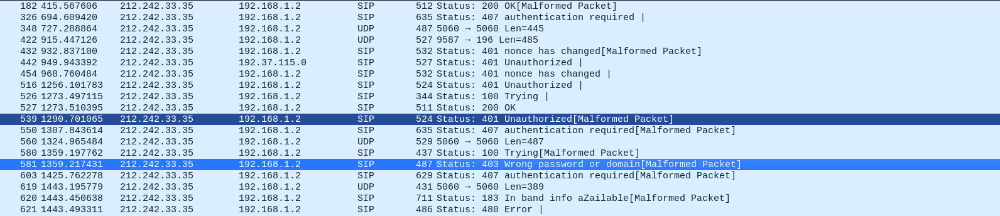

# Solution

The question says that the password was not correct , which means authentication Invalid !

Upon searching for status code : 401 or 403 we got ->



The source Ip is our flag

``` Flag : vishwaCTF{212.242.33.35}```