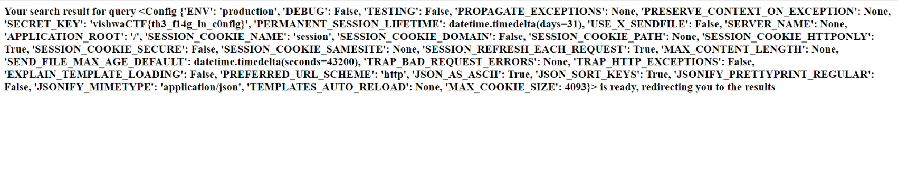

# Solution

Whatever you type into it redirects to Youtube , but there is a page in middle that process the request for a second .

So I tried for exploiting the template as {{8*8}} which was processed as 64 in the middle page.

So after seeing this it was clear that it's Server-side template injection vulnerability.

So gave {{config}} as input and got ->



``` FLAG : vishwaCTF{th3_f14g_1n_c0nf1g} ```